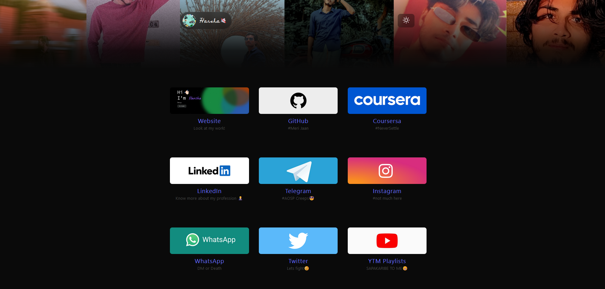

# HRS8.github.io

Welcomne to HRS8 the open source alternative for showing your social media links.

HRS8 believes in the amazing power of open source and the community. We are developing an amazing and thriling project, where increible ideas can come to life.

Join us and be part of this great community, where you can learn and share your knowledge with others.



## Our Tech Stack 🛠️

- [React](https://reactjs.org/): Powerful JavaScript library for building user interfaces.
- [TypeScript](https://www.typescriptlang.org/): The strong typed Javascript.
- [Vite](https://vitejs.dev/): Next Generation Frontend Tooling.

## Contributions 🤝

Feel free to contribute!! If you have an idea, want to add a new feature, fix a bug or improve the code, please open a [issue](https://github.com/HRS8/HRS8.github.io/issues/new) or send a pull request. Make sure to always follow the [contribution guidelines](./CONTRIBUTING.md) when submitting new code.

> **Note**: If you are new to open source contributions, you can refer to [this](https://opensource.guide/how-to-contribute/) guide by GitHub.

## Getting Started 🚀

Follow these steps to get started with the Linktree Clone:

1. Fork the repository

2. Clone the repository:

```bash
git clone https://github.com/HRS8/HRS8.github.io.git
```

3. Change into the poject directory:

```bash
cd HRS8.github.io
```

4. Install project dependencies:

```bash
npm install
```

5. Install project dependencies:

```bash
npm run dev
```

## Distinct Features 🌟

It comes with some amazing features like:

1. `Song play/pause`: You can include a song that visitors can play and pause, adding a unique touch to your linktree page.
2. `Dark/Light Themes`: Users can switch between dark and light themes, enhancing the visual appeal and user experience.
3. `Noob Friendly`: This project is designed to be beginner-friendly, making it accessible to developers of all skills levels.

## License 📝

[MIT](LICENSE)
